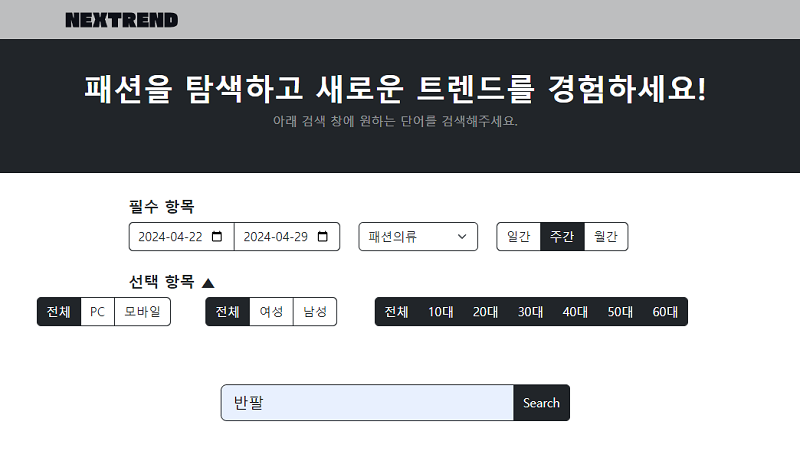
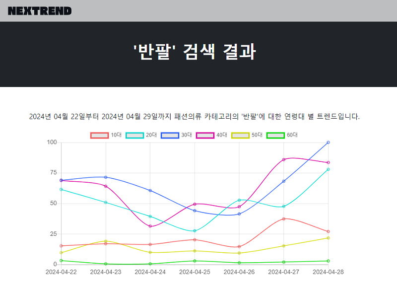
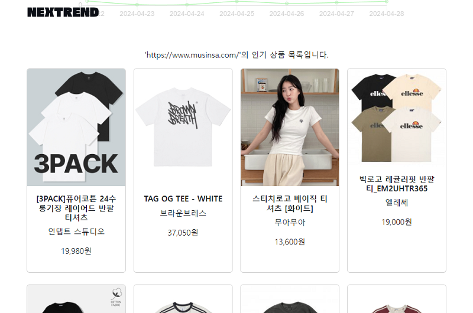

# 

<b>Next Trend, 다음 유행을 빠르게 살펴볼 수 있는 웹사이트를 만들자는 의미입니다.</b>

---

### 배포 링크(잠시 중단) : https://nextrend.shop

### 사용 방법

1. <b>필수 항목의 startDate, endDate, category, timeUnit을 설정한다.</b> 
    (기본적으로 현재 날짜로부터 일주일 전, 패션의류, 주간 설정)
2. <b>선택 항목의 device, gender, ages를 설정한다.</b> 
   (기본적으로 전부 ALL 설정)
3. <b>검색어 입력 후 검색 or Enter</b>

### 검색 결과

※ 주의사항 
- 네이버 쇼핑인사이트 API를 사용하고 있기 때문에 검색 결과가 없을 경우 그래프가 제대로 그려지지 않을 가능성이 있습니다. 
특히 timeUnit을 주간, 월간으로 설정했을 때, 구간 단위에 해당하는 날짜에 검색 데이터가 없을 경우 제대로 그려지지 않을 가능성이 있습니다.
- 오픈 API 일일 허용량이 정해져 있어 1,000번 호출될 경우 그래프가 그려지지 않을 수 있습니다.

1) 키워드 연령별 트렌드 조회 기능 시각화

2) 쇼핑몰 사이트에 대한 상품 검색 결과
   
